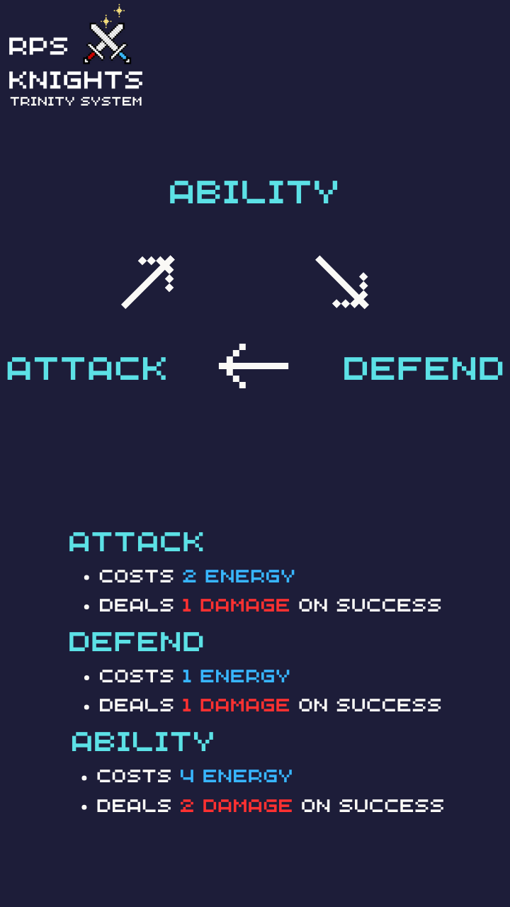

# RPS Knights

Welcome to **RPS Knights**
, a competitive twist on the timeless game of Rock, Paper, Scissors. RPS Knights also has a ranked ladder to add a competitive scene to it.

**RPS Knights** retains the core principles
 of the original RPS but layers on a novel energy system that necessitates strategic planning and foresight.

## Game Overview

1. **Health System**: At the onset of the battle, each player starts with 3 Hitpoints.
2. **Round Dynamics**: During each round, players pick their actions. The player who loses the round will lose 1 Hitpoint.
3. **Endgame Condition**: The bout persists until one player's Hitpoints drops to 0.

## Gameplay Guide

To kick-start your journey in **RPS Knights**, here's a concise guide:

- **Initial Setup**: Both players begin with:
  - **3 Hitpoints**
  - **5 Energy points**
  
- **Action Selection**: Each player selects an action, and the outcome depends on the trinity system (Rock, Paper, Scissors). The player with the superior action wins the round.

  

- **Post-Round Energy Mechanics**: 
  - After each round concludes, players receive 1 Energy.
  - Successful actions can grant players bonus energy regeneration.

Good luck

---

*RPS Knights is still in early development with features being tested & removed/added*

